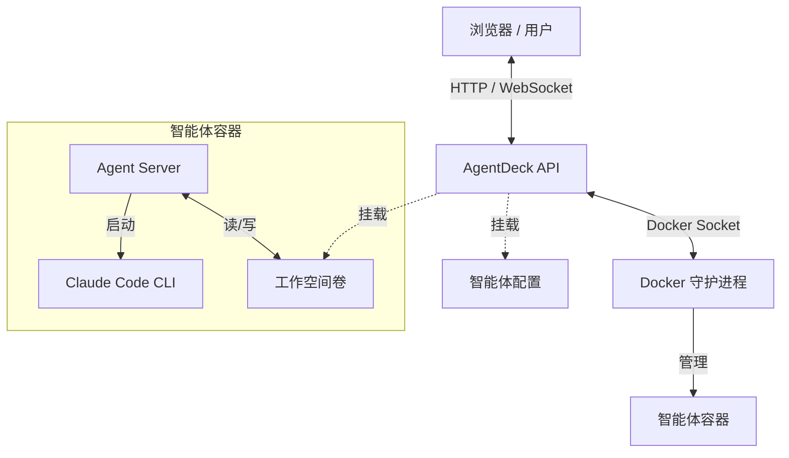

# AgentDeck 架构文档

AgentDeck 是一个用于在隔离的 Docker 容器中编排 Claude 智能体的控制平面。它提供通过 Web 界面来管理智能体生命周期、配置环境，并通过聊天和终端日志与智能体进行交互。

## 系统概览

系统由三个主要部分组成：

1.  **AgentDeck UI (前端)**: 基于 React 的单页应用。
2.  **AgentDeck API (后端)**: 一个 FastAPI 服务，用于管理状态和 Docker 操作。
3.  **Agent Runtimes (工作节点)**: 运行智能体逻辑的临时 Docker 容器。



## 组件详情

### 1. 前端 (AgentDeck UI)
- **框架**: React + Vite
- **样式**: Tailwind CSS
- **核心功能**:
    - **智能体管理**: 列表显示、启动、停止、启动、删除智能体。
    - **聊天界面**: 基于 SSE (Server-Sent Events) 的流式聊天，与智能体交互。
    - **终端**: 集成 `xterm.js`，通过 WebSocket 流式传输智能体容器的原始日志。
    - **配置**: 用于 MCP 服务器和环境变量的 JSON 编辑器。
- **状态管理**: 
    - 通过轮询 (`fetchAgents`) 与后端同步。
    - 维护活跃的会话令牌 (`session token`)。

### 2. 后端 (AgentDeck API)
- **框架**: FastAPI
- **职责**:
    - **智能体注册表**: 在 `runtime_state/registry.json` 中跟踪运行中/已停止的智能体。
    - **会话管理器**: 处理经过身份验证的会话 (`x-session-token`)、空闲超时和令牌轮换。
    - **Docker 管理器**: 封装 `docker-py` 以控制容器、挂载卷和管理网络。
    - **代理转发**: 将聊天请求代理到特定智能体容器的内部 HTTP 服务器。
- **数据持久化**: 
    - `runtime_state/registry.json`: 在后端重启后持久化智能体元数据。
    - Docker 卷: 持久化智能体工作空间 (`agentdeck-workspace-{id}`)。

### 3. 智能体运行时 (Worker)
- **基础镜像**: `python:3.11-slim` + `Node.js 20`
- **核心进程**: `agent_server.py` (容器内运行在 3000 端口的 FastAPI/Uvicorn 服务)。
- **智能体逻辑**: 
    - 使用 `claude-code` CLI (通过 npm 安装)。
    - 可以执行工具：Bash、文件读写等。
- **隔离性**: 每个智能体在自己的容器运行，并拥有专用的工作空间卷。

## 核心工作流

### 智能体生成 (Spawning)
1.  **请求**: 用户发送配置 (工具、提示词等) 到 `POST /api/agents`。
2.  **后端**:
    - 生成唯一的 `agent_id`。
    - 将 `agent-config.json` 写入主机文件系统。
    - 创建 Docker 容器，包含：
        - 挂载配置 (只读)。
        - 挂载工作空间卷 (读写)。
        - 环境变量 (API 密钥、MCP 环境)。
3.  **运行时**: 容器启动，`agent_server.py` 加载配置并初始化智能体。

### 聊天交互
1.  **用户**: 在聊天 UI 中输入消息。
2.  **前端**: 发送 POST 请求到 `/api/agents/chat`，携带 `session_id`。
3.  **后端**:
    - 验证会话。
    - 查找容器 IP/端口。
    - 将请求代理转发到 `http://<container>:3000/query`。
4.  **智能体**: 处理查询，流式返回响应 (SSE)。
5.  **后端**: 将 SSE 流转发给前端。

### 日志流
1.  **前端**: 连接到 `ws://.../ws/agents/{id}/logs`。
2.  **后端**: 
    - 附加到 Docker 容器日志 (`docker logs -f`)。
    - 将日志行流式传输到 WebSocket。
    - 前端在 xterm.js 中渲染日志行。

## 目录结构

```
AgentDeck/
├── backend/               # FastAPI 后端
│   ├── app/               # 主要 API 逻辑
│   │   ├── main.py        # 路由和入口点
│   │   ├── docker_mgr.py  # Docker 编排
│   │   └── session_mgr.py # 认证和会话
│   └── runtime_state/     # 持久化的注册表和配置 (gitignored)
├── frontend/              # React 应用程序
├── runtime/               # 智能体工作节点镜像资源
│   ├── Dockerfile
│   └── container/         # 智能体服务器代码
├── docs/                  # 文档
│   ├── architecture/      # 架构文档
│   ├── plans/             # 设计和实现计划
│   ├── references/        # 参考资料
│   └── guides/            # 用户/开发指南
├── scripts/               # 工具脚本
└── config/                # 静态配置文件
```

## 安全与配置
- **API 密钥**: 后端需要 `ANTHROPIC_API_KEY` 才能将其注入到智能体容器中。
- **会话令牌**: 用于授权敏感操作（停止、删除、聊天）。
- **隔离**: 智能体无法访问主机文件（除了挂载的配置）或其他智能体（除非通过网络启用）。
